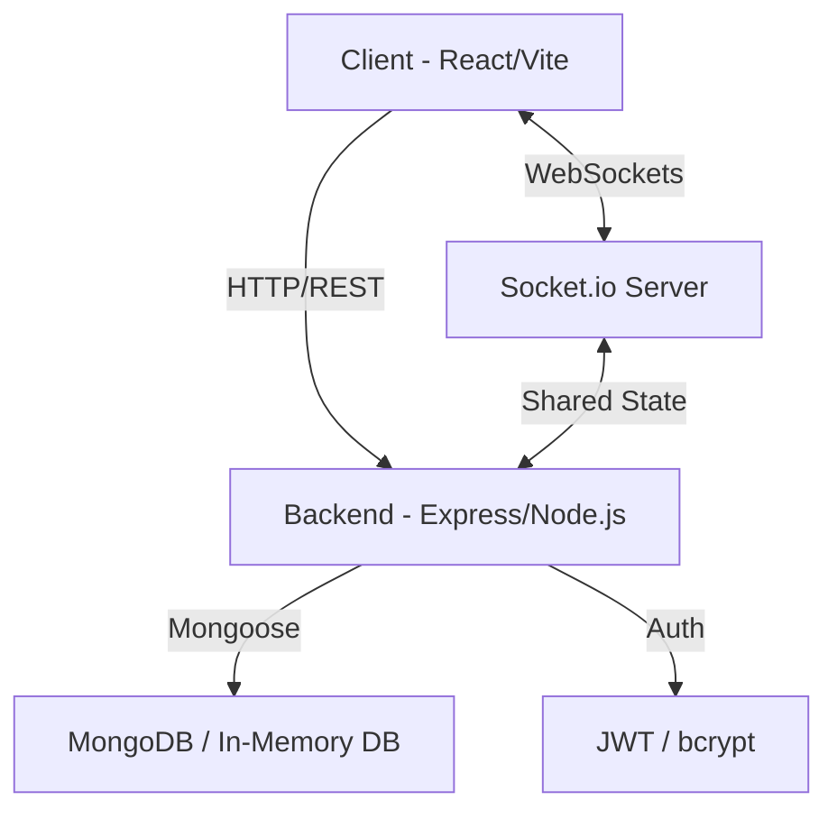

# RideFlow - Real-Time Ride Sharing App

> **Zero-Config Developer Setup**: RideFlow uses `mongodb-memory-server` out of the box! If you do not have Docker or a local MongoDB database running, the Node server will automatically detect it and instantly spin up a temporary, native in-memory database! You literally just need to type `npm run dev` to get the entire full-stack app running locally without configuring anything!

RideFlow is a full-stack, real-time ride-sharing application built using the MERN stack (MongoDB, Express, React, Node.js) with Socket.io for live driver tracking and Mapbox for mapping visualization.

## 🚀 Key Features

- **Live Driver Tracking**: Stay updated with real-time driver locations on a high-fidelity Mapbox interface.
- **Instant Matching Engine**: Sophisticated backend logic to connect riders with the nearest available drivers.
- **Glassmorphic UI**: A premium, modern look and feel built with Tailwind CSS v4 and Framer Motion.
- **In-Memory Database Ready**: Start developing immediately without a complex local database setup.
- **Smart Fare Estimator**: Dynamic pricing based on distance and estimated travel time.

## 🛠️ Technologies Used

- **Frontend**: React (Vite), Zustand, TailwindCSS v4, Mapbox GL JS, Socket.io-client, Axios, Lucide React
- **Backend**: Node.js, Express, Socket.io, MongoDB (Mongoose), JWT, bcrypt
- **DevOps**: Docker Compose, MongoDB Memory Server for seamless local development.

## 📐 Project Architecture



## 🏁 Getting Started

### Prerequisites

- Node.js (v18+)
- Mapbox API Token (for the map component)

### Setup Instructions

1. **Environment Configuration**
   - Copy `server/.env.example` to `server/.env` and update variables.
   - Copy `client/.env.example` to `client/.env` and insert your Mapbox token.

2. **Starting the Application**
   ```bash
   # In the root directory (using the zero-config setup)
   cd server && npm install && npm run dev
   cd ../client && npm install && npm run dev
   ```

## 🔐 Application Security & Auth

- **JWT Authentication**: Secure stateless authentication for all API routes.
- **Role-Based Access**: Specialized dashboards for both Riders and Drivers.
- **Payload Encryption**: All sensitive user data is hashed using bcrypt.

---

## 📄 License

This project is licensed under the [MIT License](LICENSE).

## 🤝 Contributing

Contributions are welcome! Please see [CONTRIBUTING.md](CONTRIBUTING.md) for details.
